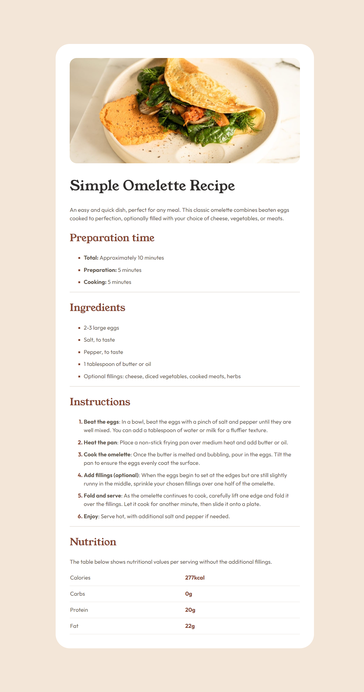

# Frontend Mentor - Recipe page solution

This is a solution to the [Recipe page challenge on Frontend Mentor](https://www.frontendmentor.io/challenges/recipe-page-KiTsR8QQKm). Frontend Mentor challenges help you improve your coding skills by building realistic projects. 

## Table of contents

- [Overview](#overview)
  - [The challenge](#the-challenge)
  - [Screenshot](#screenshot)
  - [Links](#links)
- [My process](#my-process)
  - [Built with](#built-with)
  - [What I learned](#what-i-learned)
  - [Continued development](#continued-development)
  - [Useful resources](#useful-resources)

## Overview

### Screenshot

### Links

- Solution URL: [GitHub](https://github.com/mohammad-sayed-ahmad/recipe-page-component)
- Live Site URL: [Github Pages](https://mohammad-sayed-ahmad.github.io/recipe-page-component/src/index.html)

## My process

### Built with

- HTML:
  - Sematic HTML Markup
- CSS:
  - Flexbox
  - Media Queries
- Accesibility Testing (NVDA)
- Mobile development

### What I learned

- To table border styling work, use `table td`.
- You can use: `line-height: 1.5;`
- `1em` means one line

### Continued development
- Use of less margins and relying more on flexbox

### Useful resources

- [CSS Tricks](https://csstricks.com) - This helped me find how to make table border works. Excellent resource for development for new web devolpements.
